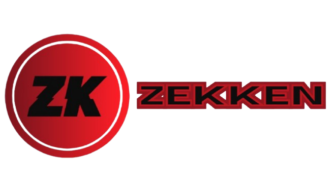

  <picture>
    
  </picture>

# Zekken Language Support for VS Code Extension

This is an open source Visual Studio Code extension for my programming language [Zekken](https://github.com/OzRAGEHarm/Zekken) to highlight syntax, have linting support for errors and autocomplete (both coming soon)!

## Downloading the extension
You can find and install the extension by going [here](https://marketplace.visualstudio.com/items?itemName=OzRAGEHarm.zekken-language-support) or by searching `Zekken Language Support` on the "Extensions" tab in Visual Studio Code.