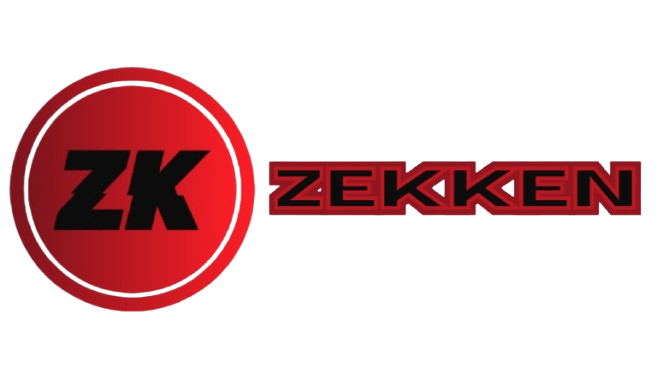

<div align="center">
  <picture>
    
  </picture>
</div>

# Zekken Language Support

Visual Studio Code / code-server extension for the [Zekken Programming Language](https://github.com/OzRAGEHarm/Zekken).

This extension is intentionally pragmatic: type as you go and get fast feedback.
It focuses on hover docs, completions/snippets, and real-time diagnostics (Problems panel).

## Quick Summary

You get:

- Syntax highlighting for `.zk`
- Hover docs (keywords, types, built-ins, libraries, operators)
- Completion + snippets (especially for `@` built-ins and call syntax)
- Static diagnostics for common mistakes (missing types, bad call syntax, undefined symbols, etc.)

You do not get (yet):

- A runner (use the `zekken` CLI)
- Full semantic type inference (Zekken uses explicit types)
- Perfect runtime parity in every edge case (this is static analysis)

## Features

- Syntax highlighting for `.zk` files
- Context-aware hover docs for:
  - keywords
  - types
  - built-ins
  - standard libraries and members
  - operators
- Smarter symbol hovers (when available):
  - hover a variable use-site to see its declaration and location
- Autocomplete for:
  - keywords and types
  - `@` built-ins (with snippets)
  - libraries and library members
  - in-file variables and functions
- Real-time diagnostics in the Problems panel (pre-run linting), including:
  - missing/invalid type annotations
  - type mismatch checks (with fix suggestions in messages)
  - invalid or incomplete call syntax
  - malformed control-flow/function syntax
  - unknown libs/members/built-ins
  - invalid cast targets
  - const reassignment
  - undefined symbols
  - unmatched delimiters and more

## Examples

### Built-ins vs library functions

- Built-ins are **native functions** prefixed with `@`:

```zekken
@println => |"Hello!"|
```

- Library members are also native functions, but are called via member access:

```zekken
use math;
let x: float = math.sqrt => |9.0|;
@println => |x|
```

### What the diagnostics are meant to catch

```zekken
let wrong_type: int = 3.14; // type mismatch
@println => |unknown_var|     // undefined symbol
```

## What This Extension Does Not Do (Yet)

- Execute Zekken code (use the `zekken` CLI for running scripts)
- Provide full semantic analysis/type inference (Zekken requires explicit types)
- Guarantee perfect parity with runtime behavior in every edge case (diagnostics are static analysis)

## Install

### Marketplace

Install from VS Code Marketplace:

- <https://marketplace.visualstudio.com/items?itemName=OzRAGEHarm.zekken-language-support>

Or search for `Zekken Language Support` in Extensions.

### Install from VSIX

1. Build a VSIX:

```bash
npm install
npm run build:linux
```

2. Install:

```bash
code --install-extension dist/zekken-language-support-<version>.vsix
```

For code-server:

```bash
code-server --install-extension dist/zekken-language-support-<version>.vsix
```

## Usage

- Open any `.zk` file and ensure VS Code detects the language mode as **Zekken**.
- Hover keywords, built-ins (prefixed with `@`), operators, and library members for docs/signatures.
- Use completion for call syntax and built-ins (snippets) as you type.
- Watch the Problems panel for lint/diagnostic feedback before you run the code.

## Configuration

There are no user-facing settings yet. If you want the extension to grow configurable behavior (rules, severities, etc.),
open an issue and describe your workflow.

## Development

### Prerequisites

- Node.js 18+ (Node.js 20+ recommended)
- npm
- VS Code or code-server

### Build scripts

- Linux/macOS:

```bash
./build-vsix.sh
```

- Windows:

```bat
build-vsix.bat
```

Equivalent npm scripts:

```bash
npm run build:linux
npm run build:win
```

### Run In Extension Host (Local Dev)

1. Open this repo in VS Code.
2. Run `npm install`.
3. Press `F5` to launch an Extension Development Host window.
4. Open a `.zk` file in the dev host to test hovers/completions/diagnostics.

## Project structure

- `extension.js`: VS Code client bootstrap
- `server.js`: language server (hover, completion integration)
- `diagnostics.js`: diagnostics/lint engine
- `hover-data.json`: hover docs + completion data source
- `syntaxes/zekken.tmLanguage.json`: TextMate grammar
- `token-colors.json`: token color contributions

## Troubleshooting

- If you don't see diagnostics/hover:
  - Confirm the file ends in `.zk` and the language mode is set to Zekken.
  - Reload VS Code (`Developer: Reload Window`).
  - Check `View -> Output` and select the Zekken/LSP output channel (if present).
- If you're on code-server:
  - Ensure the extension is installed for the correct scope (user vs workspace).

## Notes

- Diagnostics are static analysis and may still differ from runtime behavior in edge cases.
- Keep `hover-data.json` updated when language keywords, built-ins, or library APIs change.
